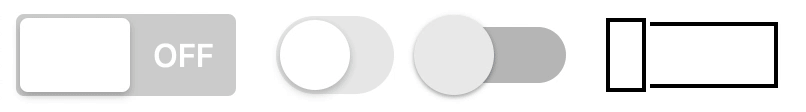

# React Toggle

> Note: The rough animation in the demo is due to the GIF running at 20 FPS.

A switch toggle in React using Emotion CSS, and Framer motion.

I want to evolve this to offer different toggle styles and allowing importing
only the style you want.

This project is scaffolded using create-react-app, so it is not possible to
import it as a component in your React project. Eventually, once I decide on the
name and API, I will publish it as a standalone package that can be imported
from NPM.
