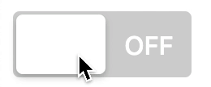

# React Styled Toggle

 

I became somewhat obssesed with the different styles of switches on different
operating systems and how they behave so I decided to create this project to
recreate them using React.

### High level vision for this project

A switch toggle in React using Emotion CSS, and Framer motion.

I want to evolve this to offer different toggle styles and allowing importing
only the style you want.

Eventually, once I decide on the name and API, I will publish it as a standalone
package that can be imported from NPM.
